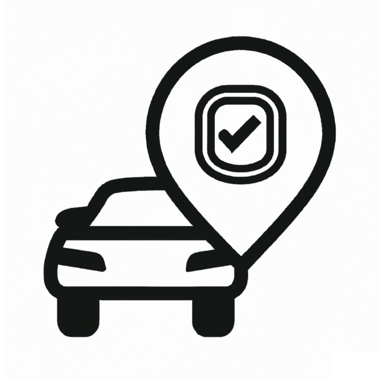
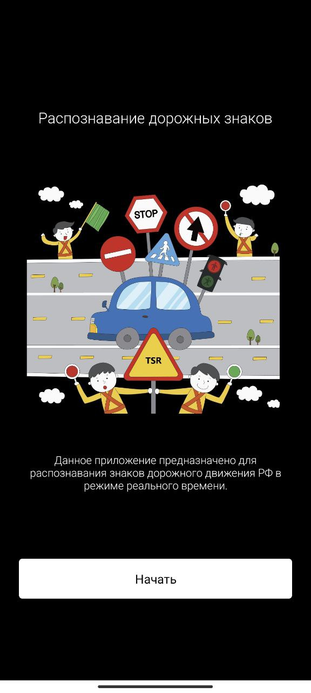
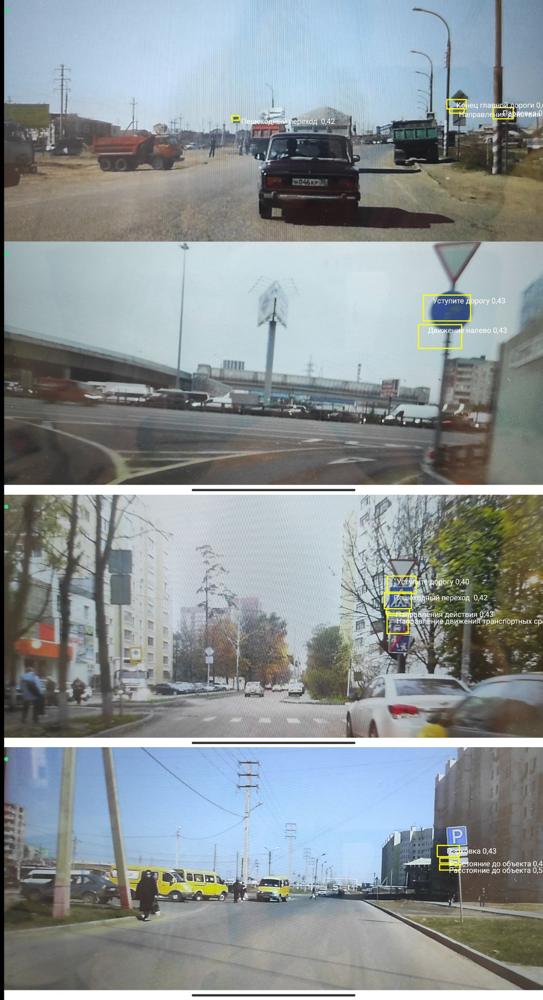

# ru-Traffic-Sign-Recognition-Android-App

	

Распознавание знаков дорожного движения РФ в режиме реального времени.

	

## Основные характеристики
- **Почему это приложение, а не навигатор?** Хоть в навигаторах и размечена большая часть дорог, использование данного приложения может быть полезным, учитывая частые изменения знаков и проведение ремонтных работ, к которым должны подстроиться данные навигатора.
- **Детекция знаков в отсутствии доступа к интернету и геолокации** 

## Под капотом

### Модель детекции
- Были использованы данные уменьшенного [датасета](https://www.kaggle.com/datasets/watchman/rtsd-small) с размеченными фотографиями российских дорог
- Данные были предобработаны, часть удалена, получилось 178 классов различных знаков
- Использовалась предобученная модель `YOLOv5s`
- Данные были переведены в формат, необходимый модели
- Модель обучалась в течение 47 эпох
- Лучший `mAP50` на валидационной выборке: 12.8% ☹
- Модель была сериализиована для дальнейшего импорта в Android-приложение

[Google Colab](https://colab.research.google.com/drive/1EGSP0TyhGxu1O0yMOtRDWPWlfpZuCm00)

### Android-приложение
В файл конфигурации сборки были добавлены следующие зависимости, позволяющие работать с моделью и запускать камеру на устройстве: 
- org.pytorch:pytorch_android
- org.pytorch:pytorch_android_torchvision
- androidx.camera:camera-core

[APK](https://drive.google.com/file/d/1YMPul6S5lCAsLSBQNrfD-A8b9Z51zc8X)

 
## Примеры работы

	

## В планах
- Усовершенствовать модель детекции знаков путем обучения на расширенном датасете
- Добавить определение расстояния до знака и в соответствии с этим дальнейших указаний водителю
- Добавить голосовое сопровождение.

